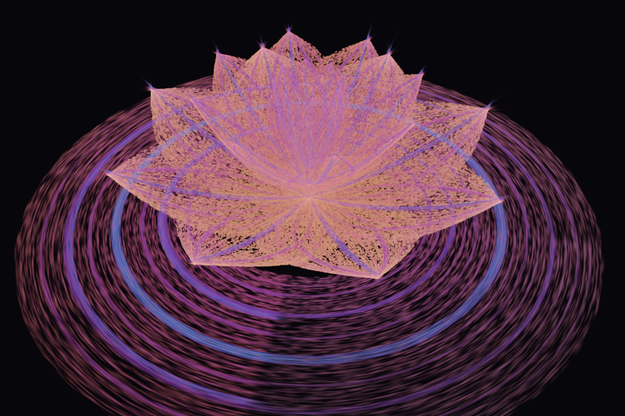

# Lotus Flame



*The Lotus nebula preset in full bloom (t = 1), as rendered by this page. Not retouched.*

A 4-D fractal flame you can watch bloom, in one self-contained web page. Every point keeps its place in the
fractal as the flower opens, so the bloom slides smoothly instead of re-burning, and each point is drawn as a
small 3-D Gaussian shaped by the fractal around it. The result can be exported as a 3D Gaussian Splatting
`.ply` file.

Lotus Flame is a **sister project of [Bristorbrot](https://github.com/dougbristor/bristorbrot)**. It uses the
same method (small checked building blocks, assembled by a thin page) on a different body: an ordinary
**R⁴ affine IFS with flame variations** (linear, spherical, swirl, bubble, sinusoidal). It uses no
Bristorian algebra.

## Run it

**Online:** [bristorbrot.org/lotus](https://bristorbrot.org/lotus/), serving these exact files.

**Locally:** serve this folder with any static web server and open it in a browser with WebGL2 and
`EXT_color_buffer_float`:

```sh
python3 -m http.server 8000
# then open http://localhost:8000/ in your browser
```

No build step and no dependencies: the page loads only its own files.

## What it shows

- **Rolling points.** Each point has a fixed address in the IFS: a sequence of map choices drawn from a hash
  of its index. Its position is that composition of maps, computed in one GPU pass. The address never depends
  on the parameters, so when a slider moves or the bloom keyframes ease (bud → bloom), every point slides to its
  new place as the same point. "Addresses: reseeded" switches to the classic chaos game for comparison.
- **b-splats.** The same pass carries the Jacobian J of the outer maps. Each point is drawn as a 3-D Gaussian
  with covariance **Σ = J Σ_A Jᵀ**, where Σ_A is the covariance of the whole attractor: the footprint of the
  small copy of the fractal the point sits in.
- **The lotus.** Each petal is a flame-textured sheet (an IFS on the unit square, with a midrib and side veins
  that lift into w). A final map cups it into a petal and places it on one of three rings. Bloom eases the
  tilt, cup, bend and vein lift.
- **4-D turn.** Rotations in the xw, yw and zw planes act before the projection to 3-D, and w can be shown
  as hue.
- **Flatness meter.** √(λ₃/λ₂) of each splat's 3-D covariance, as a histogram. 0 means the local piece is a
  sheet or a thread; 1 means it is solid.
- **Export.** Writes a 3DGS `.ply` (position, normal, colour, opacity, scale, rotation per splat).

## Presets

| preset | what it shows |
|---|---|
| Lotus nebula (4-D) | the bloom: rolling points and sheet-shaped splats |
| Flame flower | symmetry inside the IFS: every petal is a tiny copy of the whole flower |
| Flat flame → thick | a gasket whose maps squash z: the flatness meter goes from 0.000 to 0.33 |
| Menger sponge | the solid reference: the meter reads 0.99 |

## Files

| file | what |
|---|---|
| `ifs.js` | the maths: maps, variations, presets as data, a float64 CPU mirror of the GPU code, and the GLSL |
| `renderer.js` | the GL passes: evaluate, draw, read back. No UI |
| `ply.js` | the 3DGS `.ply` writer |
| `bare.html` | the building blocks alone, with a preset picker, a slider and drag |
| `index.html`, `app.js` | the full page: panel, bloom keyframes, 4-D turn, flatness meter, export, shareable URL state |
| `tools/check.mjs` | the checks below |

## Checks

`node tools/check.mjs` (Node 22.7+, `npm i playwright`, `npx playwright install firefox`) serves this folder
on a private port and runs six checks. `LOTUS_BASE=https://bristorbrot.org/lotus/demo/ node tools/check.mjs` runs the
same checks against the hosted copy. Each one has a planted fault that must make it fail, so a check that
cannot fire is reported as dead.

| check | what it compares | planted fault |
|---|---|---|
| G | GPU float32 positions and Σ against the CPU float64 mirror (5 states) | wrong seed |
| J | analytic Jacobian against central finite differences | transposed step Jacobian |
| R | rolling: moving t by dt moves points by O(dt) | reseeded addresses |
| F | flatness meter on a thin sheet (≈ 0) and the Menger sponge (≈ 1) | the two references themselves |
| X | `.ply` round trip: Σ rebuilt from the written scale and rotation | quaternion written in the wrong order |
| V | every preset and the bare page draw, with no page errors | |

All pass on the published files and on the hosted copy (2026-10-07).

**Open:** no independent 3DGS viewer has loaded the exported `.ply` yet. The encoding round trip (X) agrees
to 5e-7, but the claim that the export opens correctly elsewhere still needs a real viewer, overlaid at the
same camera. The live additive look will also differ from an alpha-sorted 3DGS render.

## Changes

Every change and every correction, newest first, with what proved it: [RECEIPTS.md](RECEIPTS.md).

## Credits and licence

Built by insights, an AI agent of [The Orchard](https://bristorbrot.org), with Doug Bristor, 2026.
MIT licence: see [`LICENSE`](LICENSE).
